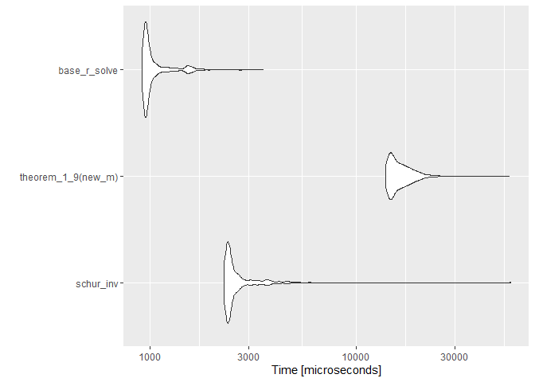

<!-- README.md is generated from README.Rmd. Please edit that file -->

# MatrixAnalysis101

<!-- badges: start -->

<!-- badges: end -->

The goal of MatrixAnalysis101 is to … Run some elementary matrix algebra
proprieties \#\# Installation

You can install the released version of MatrixAnalysis101 from
[CRAN](https://CRAN.R-project.org) with:

``` r
install.packages("MatrixAnalysis101")
```

## Example

This is a basic example which shows you how to solve a common problem:

``` r
library(MatrixAnalysis101)
## basic example code
```

What is special about using `README.Rmd` instead of just `README.md`?
You can include R chunks like so:

``` r
summary(cars)
#>      speed           dist       
#>  Min.   : 4.0   Min.   :  2.00  
#>  1st Qu.:12.0   1st Qu.: 26.00  
#>  Median :15.0   Median : 36.00  
#>  Mean   :15.4   Mean   : 42.98  
#>  3rd Qu.:19.0   3rd Qu.: 56.00  
#>  Max.   :25.0   Max.   :120.00
```

You’ll still need to render `README.Rmd` regularly, to keep `README.md`
up-to-date.

You can also embed plots, for example:


In that case, don’t forget to commit and push the resulting figure
files, so they display on GitHub\!

Construa um programa que, dada uma matriz quadrada não singular qualquer
calcula sua inversa a partir do resultado do teorema apresentado a
inversa e as matrizes \(A\), \(B\), \(C\) e \(D\) escolhidas.

\[G = (A + C B D)\]

## Processo de aprendizado e Objetivos faltantes

#### Lista de coisas que eu precisei aprender ou revisitar para chegar até onde cheguei.

  - ✔️ Relembrar conceitos operações básicas com matrizes
  - ✔️ Relembrar Propriedades da matrix inversa e seu caracter exclusivo
  - ✔️ Operações com matrizes em blocos
  - ✔️ Encontrar \(A\), \(B\), \(C\) e \(D\)
  - ✔️ **Complemento de Schur**
  - ✔️ \*Encontrar a inversa da matrizes densas de uma maneira mais
    eficiente do que tirar a inversa na mão

## O teorema 1.9 de Schott \[1\]

Sejam \(A_{mxm}\) e \(B_{nxn}\) matrizes não singulares
(\(det(A) \neq 0\) e \(det(B) \neq 0\)). Para qualquer matriz
\(C_{mxn}\) e qualquer matriz \(D_{nxm}\), vale que \(A + CBD\) é não
singular, então
\[G^{-1} = (A + CBD)^{-1} = A^{-1} - A^{-1}C(B^{-1}+DA^{-1}C)^{-1} DA^{-1}\]

  - Na mesma aula em que passou a atividade Kim deu a dica de que \(A\)
    ou \(B\) deveriam ser a matrix identidade com a dimensão pertinente
    a matrix \(G\), para comportar a dimensão na igualdade
    \(G = A + CBD\).

### A busca por \(CBD\)

Intuitivamente, meu ponto de partida foi ir atrás de \(A\), \(B\), \(C\)
e \(D\). Com a dica do Kim \(A = I_{m}\) foquei em ir atrás do resultado
\(G - A = CBD\) e após assitir alguns videos de
[Gilbert](https://www.youtube.com/watch?v=rYz83XPxiZo)
[Strang](https://www.youtube.com/watch?v=mBcLRGuAFUk&t=241s) para
relembrar conceitos fundamentais de factorização, autovalores,
autovetores e decomposição espectral (Acabei vendo os videos sobre
**SVD** que eu não havia visto em algebra linear\!)

#### Decomposição Espectral

Vamos chamar \(CBD = Δ\), se \(Δ_{nxn}\) com \(n\) autovalores e \(n\)
autovetores linearmente independentes a matrix \(Δ\) pode ser fatorizada
por \[2\] \[Δ = VΛV^{-1}\] onde \(V_{nxn}\) é matrix de autovetores e
\(Λ_{nxn}\) matriz diagonal com os autovalores de \(Δ\). Assim, obtemos
\(C = V\), \(B = Λ\) e \(D = V^{-1}\). Esse resultado tem alguns
**problemas**.

  - Achar D é inviavel para resolver nosso problema, estariamos
    encontrando a inversa de uma matriz \(nxn\) para depois multiplicar
    por outras matrizes par chegar na matriz original que também é
    \(nxn\).
  - As dimensões estão erradas para todas as matrizes, já que
    \(C_{mxn}\), \(D_{nxm}\) e \(B_{nxn}\)

#### Singular Value Decomposition

A decomposiçaõ em valores singulares, **SVD** em inglês, resulta em uma
fatoração relacionada aos autovalores de uma matriz \(S\) quadrada ou
não em três outras matrizes: \[S = UΣV^{T}\] Onde as colunas de \(U\) e
\(V\) são orthonormais. As colunas \(U\) e \(V\) são os autovetores de
\(SS^{T}\) e \(S^{T}S\) respectivamente. \(Σ\) é a matriz diagonal com
os \(\sqrt{autovalores} \neq 0\) de \(SS^{T}\) e \(S^{T}S\).  
Dessa forma, conseguimos encontrar todas as matrizes
\(C_{mxn} = U_{mxn}\), \(B_{nxn} = Σ_{nxn}\) e \(D_{nxm} = V_{nxm}^{T}\)
Para confirmar que funciona vamos usar o exemplo do livro \[3\]

\[
G = A + CBD
\] \[
G - A = CBD = G - I_{5}
\] \[
= \begin{bmatrix}0&1&1&1&0 \\-1&5&4&3&1 \\-1&2&1&0&1 \\-2&6&4&2&2 \\-1&4&3&2&1 \\\end{bmatrix}
\] Sejam \[
C = \begin{bmatrix}1&0 \\2&1 \\-1&1 \\0&2 \\1&1 \\\end{bmatrix} B =  \begin{bmatrix}1&1 \\1&2 \\\end{bmatrix} D = \begin{bmatrix}1&-1&0&1&-1 \\-1&2&1&0&1 \\\end{bmatrix}
\]

\[
C B D = \begin{bmatrix}1&0 \\2&1 \\-1&1 \\0&2 \\1&1 \\\end{bmatrix} \times \begin{bmatrix}1&1 \\1&2 \\\end{bmatrix} \times \begin{bmatrix}1&-1&0&1&-1 \\-1&2&1&0&1 \\\end{bmatrix}
\] Nossa matriz \(S\) vai ser \[
S = \begin{bmatrix}0&1&1&1&0 \\-1&5&4&3&1 \\-1&2&1&0&1 \\-2&6&4&2&2 \\-1&4&3&2&1 \\\end{bmatrix}
\] Vamos agora usar *SVD* para encontrar \(C\), \(B\) e \(D\)

``` r
#Quantas linhas são Linearmente independentes
reduc_depen <- pracma::rref(G_m - diag(5))
n_depen <- dim(reduc_depen[rowSums(reduc_depen),])[1]
# SVD
S_svd <- svd(G_m - diag(5),
             # Ja que a matriz e quadrada:
             nu = n_depen, nv = n_depen)
S_sig <- diag(S_svd$d)
S_sig_f <- S_sig[rowSums(S_sig) > 1e-10, colSums(S_sig) > 1e-10]
S_v <- S_svd$v
S_u <- S_svd$u

S_svd_output <- zapsmall(S_u %*% S_sig_f %*% t(S_v))
```

Com \[
UΣV^{T} = \begin{bmatrix}0.12789&-0.3731 \\0.57678&-0.51704 \\0.19312&0.60225 \\0.64201&0.45831 \\0.44889&-0.14394 \\\end{bmatrix} \times \begin{bmatrix}12.38877&0 \\0&1.87572 \\\end{bmatrix} \times \begin{bmatrix}-0.20202&0.73015&0.52813&0.3261&0.20202 \\-0.45737&0.2241&-0.23327&-0.69064&0.45737 \\\end{bmatrix}
\]

\[
S = UΣV^{T} = \begin{bmatrix}0&1&1&1&0 \\-1&5&4&3&1 \\-1&2&1&0&1 \\-2&6&4&2&2 \\-1&4&3&2&1 \\\end{bmatrix}
\] Por mais que funcione, os calculos parecem mais complexos do que
tirar a inversa de nossa matrix original \(G\) na mão. Vamos confirmar
agora que a equação da inversa também funciona para as matrizes que
achamos. Lembrando que:
\[G^{-1} = (A + CBD)^{-1} = A^{-1} - A^{-1}C(B^{-1}+DA^{-1}C)^{-1} DA^{-1}\]

``` r
out_inverse <- (diag(5) - diag(5) %*% S_u %*% solve(solve(S_sig_f)+ t(S_v) %*% diag(5) %*% S_u) %*% t(S_v) %*% diag(5))
```

\[
G^{-1} = (A + UΣV^{T})^{-1} = \begin{bmatrix}-1&1.5&-0.5&-2.5&2 \\-3&3&-1&-4&3 \\3&-2.5&1.5&3.5&-3 \\2&-2&0&3&-2 \\-1&0.5&-0.5&-1.5&2 \\\end{bmatrix}
\] Que é a resposta do livro.

## Funcionamento das funções

A função theorem\_1\_9 executa todos os passos expostos acima

``` r
theorem_1_9 <- function(W, extra_output = FALSE){
  
  if(det(W) == 0) stop("\nErro!\nA matriz input é singular !\nNão faça isso!\nReveja seus conceitos")
  Inde <- diag(nrow(W))
  #Quantas linhas são Linearmente independentes ----
  reduc_depen <- pracma::rref(W - Inde)
  n_depen <- dim(reduc_depen[rowSums(reduc_depen),])[1]
  
  # SVD ----
  S_svd <- svd(W - Inde,
               # Ja que a matriz e quadrada:
               nu = n_depen, nv = n_depen)
  S_sig <- diag(S_svd$d)
  S_sig_f <- S_sig[rowSums(S_sig) > 1e-10, colSums(S_sig) > 1e-10]
  S_v <- S_svd$v
  S_u <- S_svd$u
  
  S_svd_output <- zapsmall(S_u %*% S_sig_f %*% t(S_v))
  
  out_inverse <- (Inde - Inde %*% S_u %*% solve(solve(S_sig_f)+ t(S_v) %*% Inde %*% S_u) %*% t(S_v) %*% Inde)
  
  out_inverse <- zapsmall(out_inverse)
  
  if(extra_output == TRUE){
    out <- out <- list(sua_matriz = W,
                       suas_ABCD = list(
                         A = diag(nrow(W)),
                         B = S_sig_f,
                         C = S_u,
                         D = t(S_v)
                       ),
                       sua_inversa = out_inverse
                       )
  
  } else {
      out <- out_inverse
    }
  
  return(out)
  
}
```

Caso queira visualizar o resultado das matrizes \(A\), \(B\), \(C\) e
\(D\) coloque `extra_output = TRUE`.

## Opção ao teorema 1.9

Não fiquei satisfeito com o resultado da função do Teorema 1.9. 1º
porque não consegui obter os valores iguas ao do livro e 2º porque não
senti tanta praticidade assim, o processo me parece mais custoso do que
simplesmente aplicar afunção `solve` na matriz.

Então entrei em um buraco de coelho…

Como falei no começo do documento, não consegui encontrar uma maneira de
achar \(B\), \(C\) e \(D\) de primeira. Fui então atrás de outras forams
de encontrar essa matriz. O que encontrei foi o **complemento de
Schur**, explico:

No paper \[4\] e no livro \[5\], são discutidas propriedades de matrizes
do tipo \(S = H - GE^{-1}F\), a qual chamamos o complemento *Schur* de
\(E\) em uma matriz \(A\):
\[\textbf{A}=\begin{pmatrix}\textbf{E}&\textbf{F}\\ \textbf{G}&\textbf{H}\end{pmatrix}\]  
\(A\) e \(E\) são não singulares. Então o complemento de Schur:
\[S = (A/E) = H-GE^{-1}F\] Também é não singular e \[A^{-1} = 
\begin{pmatrix}
E^{-1} + E^{-1}FS^{-1}GE^{-1} & -E^{-1}FS^{-1}\\
-S^{-1}GE^{-1} & S^{-1}
\end{pmatrix}\] \[= 
\begin{pmatrix}
E^{-1} & 0\\
0 & 0
\end{pmatrix} + 
\begin{pmatrix}
E^{-1}F\\
-I
\end{pmatrix}
S^{-1}(GE^{-1},-I)\] Vamos partir agora para o corolario
2.4(*Duncan*)\[6\]. Suponha que \(A\) e \(H\) sejam não singulares.
Então temos o complemento de Schur \[T = (A/H) = E - FH^{-1}G\] é não
singular, e \[A^{-1} = 
\begin{pmatrix}
T^{-1} & -T^{-1}FH^{-1}\\
-H^{-1}GT^{-1} & H^{-1}+H^{-1}GT^{-1}FH^{-1}
\end{pmatrix}\] \[
\begin{pmatrix}
0 & 0\\
0 & H^{-1}
\end{pmatrix} +
\begin{pmatrix}
-I\\
H^{-1}G
\end{pmatrix}
T^{-1}(-I,FH^{-1})
\] *Hotelling\[40\]*\[7\], notou que se \(A\), \(E\) e \(H\) forem todas
não singulares, então  
\[
A^{-1} =
\begin{pmatrix}
T^{-1} & - E^{-1}FS^{-1}\\
-H^{-1}GT^{-1} & S^{-1}
\end{pmatrix}
\]

Além disso, podemos então dizer que:  
\[
A^-1 = 
\begin{pmatrix}
E^{-1} & 0\\
0 & 0
\end{pmatrix} +
\begin{pmatrix}
E^{-1}F\\
-I
\end{pmatrix}
S^{-1} (GE^{-1}-I)
\] O que aparentemente é um resultado muito mais simples do que o
teorema 1.9 para encontrar a inversa de uma matriz. Abaixo segue uma
função para encontrar a inversa utilizando partições de uma matriz não
singular.

``` r
schur_inv <- function(A, extra_output = FALSE){

  if(det(A) == 0) stop("\nErro!\nA matriz input é singular !\nNão faça isso!\nReveja seus conceitos")
  
  n_row <- dim(A)[1]
  n_col <- dim(A)[2]
  th <- ifelse(dim(A)[1]%/%2, 2, 3)
  
  E_m <- A[1:(n_row - th), 1:(n_col - th)]
  F_m <- A[1:(n_row - th), (n_col - th + 1):n_col]
  P_m <- A[(n_row - th + 1):n_row, 1:(n_col - th)]
  H_m <- A[(n_row - th + 1):n_row, (n_col - th + 1):n_col]
  
  H_1 <- solve(H_m)
  E_1 <- solve(E_m)
  
  S <- H_m - (P_m %*% E_1 %*% F_m)
  S_1 <- solve(S)
  T_m <- E_m - (F_m %*% H_1 %*% P_m)
  T_m_1 <- solve(T_m)
  
  
  A_1 <- matrix(0, ncol = n_col, nrow = n_row)
  A_1[1:(n_row - th), 1:(n_col - th)] <- T_m_1
  A_1[1:(n_row - th), (n_col - th + 1):n_col] <- - E_1 %*% F_m %*% S_1
  A_1[(n_row - th + 1):n_row, 1:(n_col - th)] <- - H_1 %*% P_m %*% T_m_1
  A_1[(n_row - th + 1):n_row, (n_col - th + 1):n_col] <- S_1
  
  
  if(extra_output == TRUE){
    out <- list(
      sua_matriz = A,
      suas_ABCD = list(
        T_m_1 = T_m_1,
        A_12 = - E_1 %*% F_m %*% S_1,
        A21 = - H_1 %*% P_m %*% T_m_1,
        S_1 = S_1
        ),
      sua_inversa = A_1
      )
  } else {
      out <- A_1
    }

  return(out)
}  
```

## Conclusões

Como eu achei muito mais tranquilo entender a inversa usando o metodo de
partições de Schur, acabei tomando a liberdade de testar a performance
das duas funções para ver qual é a mais eficiente.

``` r
all.equal(
  schur_inv(new_m),
  solve(new_m)
)
#> [1] TRUE
all.equal(
  theorem_1_9(new_m),
  solve(new_m)
)
#> [1] "Mean relative difference: 3.384245e-07"
all.equal(
  theorem_1_9(new_m),
  schur_inv(new_m)
)
#> [1] "Mean relative difference: 3.384245e-07"
```



## Fontes

1.  *James R. Schott (2017) Matrix Analysis for Statistics*

2.  *Strang, G. (1998). Introduction to Linear Algebra (3rd ed.).
    Wellesley-Cambridge Press*

3.  *James R. Schott (2017) Matrix Analysis for Statistics*

4.  *Ouellette, D.V. (1981) Schur Complement and Statistics. Linear
    Algebra and Its Applications*

5.  *Simo Puntanen, George P. H. Styan (auth.), Fuzhen Zhang (eds.)
    (2005) The Schur Complement and Its Applications*

6.  *Simo Puntanen, George P. H. Styan (auth.), Fuzhen Zhang (eds.)
    (2005) The Schur Complement and Its Applications*

7.  *Simo Puntanen, George P. H. Styan (auth.), Fuzhen Zhang (eds.)
    (2005) The Schur Complement and Its Applications*
