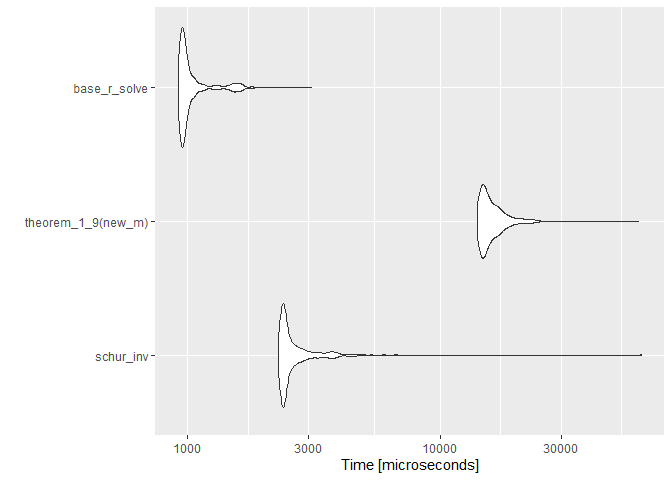

<!-- README.md is generated from README.Rmd. Please edit that file -->

# MatrixAnalysis101

<!-- badges: start -->

<!-- badges: end -->

The goal of MatrixAnalysis101 is to … Run some elementary matrix algebra
proprieties

## Installation

Você pode fazer o download do pacote no R usando:

``` r
if(!require(devtools)) install.packages("devtools")
devtools::install_github("arzevedo/MatrixAnalysis101")
```

``` r
library(MatrixAnalysis101)
```

\[G = (A + C B D)\]

## Processo de aprendizado e Objetivos faltantes

#### Lista de coisas que eu precisei aprender ou revisitar para chegar até onde cheguei.

  - ✔️ Relembrar conceitos operações básicas com matrizes
  - ✔️ Relembrar Propriedades da matrix inversa e seu caracter exclusivo
  - ✔️ Operações com matrizes em blocos
  - ✔️ Encontrar \(A\), \(B\), \(C\) e \(D\)
  - ✔️ **Complemento de Schur**
  - ✔️ \*Encontrar a inversa da matrizes densas de uma maneira mais
    eficiente do que tirar a inversa na mão

## O teorema 1.9 de Schott \[1\]

Sejam \(A_{mxm}\) e \(B_{nxn}\) matrizes não singulares
(\(det(A) \neq 0\) e \(det(B) \neq 0\)). Para qualquer matriz
\(C_{mxn}\) e qualquer matriz \(D_{nxm}\), vale que \(A + CBD\) é não
singular, então
\[G^{-1} = (A + CBD)^{-1} = A^{-1} - A^{-1}C(B^{-1}+DA^{-1}C)^{-1} DA^{-1}\]

  - Na mesma aula em que passou a atividade Kim deu a dica de que \(A\)
    ou \(B\) deveriam ser a matrix identidade com a dimensão pertinente
    a matrix \(G\), para comportar a dimensão na igualdade
    \(G = A + CBD\).

### A busca por \(CBD\)

Intuitivamente, meu ponto de partida foi ir atrás de \(A\), \(B\), \(C\)
e \(D\). Com a dica do Kim \(A = I_{m}\) foquei em ir atrás do resultado
\(G - A = CBD\) e após assitir alguns videos de
[Gilbert](https://www.youtube.com/watch?v=rYz83XPxiZo)
[Strang](https://www.youtube.com/watch?v=mBcLRGuAFUk&t=241s) para
relembrar conceitos fundamentais de factorização, autovalores,
autovetores e decomposição espectral (Acabei vendo os videos sobre
**SVD** que eu não havia visto em algebra linear\!)

## Funcionamento das funções

A função theorem\_1\_9 executa todos os passos expostos acima

``` r
theorem_1_9 <- function(W, extra_output = FALSE){
  
  if(det(W) == 0) stop("\nErro!\nA matriz input é singular !\nNão faça isso!\nReveja seus conceitos")
  Inde <- diag(nrow(W))
  #Quantas linhas são Linearmente independentes ----
  reduc_depen <- pracma::rref(W - Inde)
  n_depen <- dim(reduc_depen[rowSums(reduc_depen),])[1]
  
  # SVD ----
  S_svd <- svd(W - Inde,
               # Ja que a matriz e quadrada:
               nu = n_depen, nv = n_depen)
  S_sig <- diag(S_svd$d)
  S_sig_f <- S_sig[rowSums(S_sig) > 1e-10, colSums(S_sig) > 1e-10]
  S_v <- S_svd$v
  S_u <- S_svd$u
  
  S_svd_output <- zapsmall(S_u %*% S_sig_f %*% t(S_v))
  
  out_inverse <- (Inde - Inde %*% S_u %*% solve(solve(S_sig_f)+ t(S_v) %*% Inde %*% S_u) %*% t(S_v) %*% Inde)
  
  out_inverse <- zapsmall(out_inverse)
  
  if(extra_output == TRUE){
    out <- out <- list(sua_matriz = W,
                       suas_ABCD = list(
                         A = diag(nrow(W)),
                         B = S_sig_f,
                         C = S_u,
                         D = t(S_v)
                       ),
                       sua_inversa = out_inverse
                       )
  
  } else {
      out <- out_inverse
    }
  
  return(out)
  
}
```

Caso queira visualizar o resultado das matrizes \(A\), \(B\), \(C\) e
\(D\) coloque `extra_output = TRUE`.

## Opção ao teorema 1.9

Não fiquei satisfeito com o resultado da função do Teorema 1.9. 1º
porque não consegui obter os valores iguas ao do livro e 2º porque não
senti tanta praticidade assim, o processo me parece mais custoso do que
simplesmente aplicar afunção `solve` na matriz.

``` r
schur_inv <- function(A, extra_output = FALSE){

  if(det(A) == 0) stop("\nErro!\nA matriz input é singular !\nNão faça isso!\nReveja seus conceitos")
  
  n_row <- dim(A)[1]
  n_col <- dim(A)[2]
  th <- ifelse(dim(A)[1]%/%2, 2, 3)
  
  E_m <- A[1:(n_row - th), 1:(n_col - th)]
  F_m <- A[1:(n_row - th), (n_col - th + 1):n_col]
  P_m <- A[(n_row - th + 1):n_row, 1:(n_col - th)]
  H_m <- A[(n_row - th + 1):n_row, (n_col - th + 1):n_col]
  
  H_1 <- solve(H_m)
  E_1 <- solve(E_m)
  
  S <- H_m - (P_m %*% E_1 %*% F_m)
  S_1 <- solve(S)
  T_m <- E_m - (F_m %*% H_1 %*% P_m)
  T_m_1 <- solve(T_m)
  
  
  A_1 <- matrix(0, ncol = n_col, nrow = n_row)
  A_1[1:(n_row - th), 1:(n_col - th)] <- T_m_1
  A_1[1:(n_row - th), (n_col - th + 1):n_col] <- - E_1 %*% F_m %*% S_1
  A_1[(n_row - th + 1):n_row, 1:(n_col - th)] <- - H_1 %*% P_m %*% T_m_1
  A_1[(n_row - th + 1):n_row, (n_col - th + 1):n_col] <- S_1
  
  
  if(extra_output == TRUE){
    out <- list(
      sua_matriz = A,
      suas_ABCD = list(
        T_m_1 = T_m_1,
        A_12 = - E_1 %*% F_m %*% S_1,
        A21 = - H_1 %*% P_m %*% T_m_1,
        S_1 = S_1
        ),
      sua_inversa = A_1
      )
  } else {
      out <- A_1
    }

  return(out)
}  
```

## Conclusões

Como eu achei muito mais tranquilo entender a inversa usando o metodo de
partições de Schur, acabei tomando a liberdade de testar a performance
das duas funções para ver qual é a mais eficiente.

``` r
all.equal(
  schur_inv(new_m),
  solve(new_m)
)
#> [1] TRUE
all.equal(
  theorem_1_9(new_m),
  solve(new_m)
)
#> [1] "Mean relative difference: 3.384245e-07"
all.equal(
  theorem_1_9(new_m),
  schur_inv(new_m)
)
#> [1] "Mean relative difference: 3.384245e-07"
```



## Fontes

1.  *James R. Schott (2017) Matrix Analysis for Statistics*
